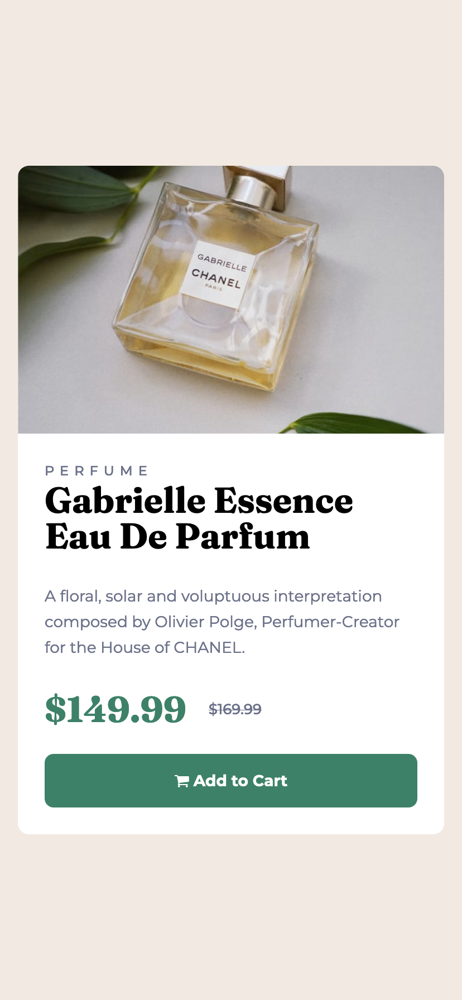

  
   
  <h2 align="center">
   <a href="https://www.frontendmentor.io/challenges/product-preview-card-component-GO7UmttRfa"  target="_blank">
        Preview Card Component - Frontend Mentor Challenge
    </a>
  </h2>

 
<!-- Badges -->

  <!-- Status -->
  

  <!-- Difficulty -->
  

 
 

## **Preview**

  <a href="https://clarerodri.github.io/Product-Card-Component-FrontendMentor/" target="_blank">Demo Live</a>
   
   
  

   
  

 

## **The challenge**
 

- Build out a Preview Card Component base on the mentor frontend challenge. It should look as close to the design as possible.

- Your users should be able to:

    - View the optimal layout depending on their device's screen size
    - See hover and focus states for interactive elements

 
 

## **Built With**

 

   
 

 

